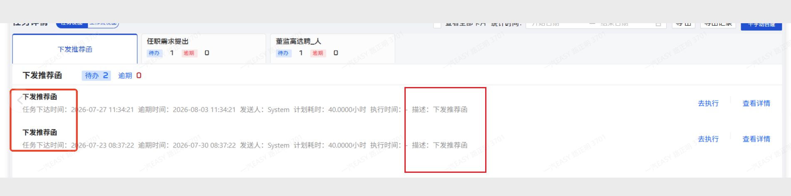

# 下发推荐函需求变更说明

> 文档状态：待确认  
> 编制日期：2026-07-27

## 一、需求背景

对“下发推荐函”相关功能进行调整，增加推荐函转发、发文下载及手机端审批能力。

## 二、需求变更

### 1. 下发推荐函增加转发功能

下发推荐函提交后，增加“转发”功能。

具体要求：

- 点击“转发”后，可以选择转发接收人。
- 默认选择该公司的管户，该公司管户只有一人。
- 用户可以取消默认选择的管户。
- 接收人支持多选。
- 可多选人员的范围为一汽股权的所有人。
- 转发成功后，通过钉钉通知接收人。

页面参考如下：

截图中页面底部包含“发文预览”和“转发”按钮，“转发”按钮位置已使用红框标注。

### 2. 发文预览增加下载功能

在“发文预览”附近增加“下载”按钮。

具体要求：

- 用户点击“下载”按钮，可以下载发文。

### 3. 下发推荐函增加手机端审批页面

下发推荐函审批需要提供手机端审批页面。

具体要求：

- 手机端审批页面及审批逻辑与以往审批逻辑一致。

### 4. 董监高选聘增加驳回操作

董监高选聘增加“驳回”操作。

具体要求：

- 点击“驳回”后，显示“是否确认驳回”确认提示。
- 用户确认驳回后，流程退回到“任职需求提出”。

页面参考如下：

### 5. 下发推荐函描述增加公司简称

下发推荐函的描述中增加公司简称。

页面参考如下：

## 三、本次变更范围

| 序号 | 需求项 | 使用端 |
| --- | --- | --- |
| 1 | 下发推荐函提交后增加转发功能 | PC 端 |
| 2 | 发文预览增加下载功能 | PC 端 |
| 3 | 下发推荐函增加审批页面 | 手机端 |
| 4 | 董监高选聘增加驳回操作 | PC 端 |
| 5 | 下发推荐函描述增加公司简称 | PC 端 |
