# 股权云工作台综合功能 PRD

> 文档版本：V1.0  
> 编制日期：2026-07-27  
> 适用项目：/Users/guocc/Documents/guquan/files/gq-gzt/  
> 文档范围：可比公司维护、外派高管履职分析、一口清  
> 说明：本文档依据当前项目页面及页面交互整理，面向产品、前端、后端及测试人员。接口形式、权限模型和技术实现方案由开发结合现有系统架构设计。

## 一、需求范围

| 序号 | 功能模块 | 页面路由 | 核心功能 |
| --- | --- | --- | --- |
| 1 | 可比公司维护任务及维护页面 | /djghome、/companyMaintenanceList、/companyMaintenance | 从任务进入维护流程，查询维护记录，维护可比公司及材料，生成并确认 AI 对标分析 |
| 2 | 外派高管履职分析任务及分析页面 | /djghome、/executiveMaintenanceList、/executiveMaintenance | 从任务进入履职分析，查询分析记录，查看月报，生成并确认人员履职分析 |
| 3 | 一口清 | /comapnyList | 选择公司和报告期、查看一企一档报告、配置显示模块、PDF 预览 |

## 二、详细功能需求

### 2.1 可比公司维护

2.1.1 可比公司维护任务页面

页面路由：/djghome

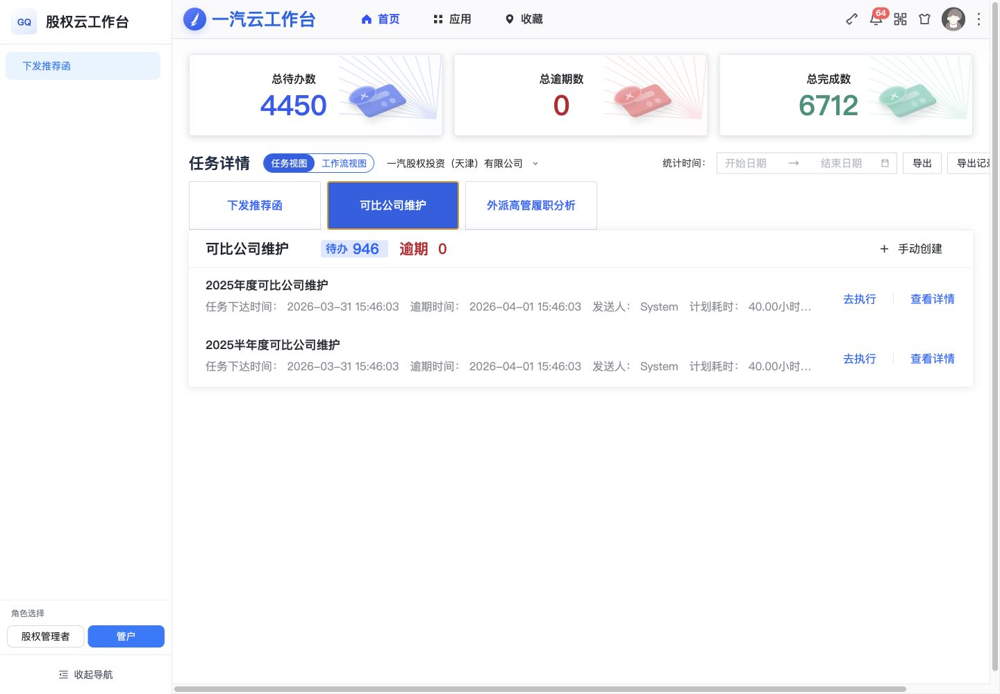

用户在任务工作台选择“可比公司维护”后，下方任务列表切换为可比公司维护任务。任务记录展示任务名称、任务下达时间、逾期时间、发送人、计划耗时、执行时间和任务描述。

- 点击“去执行”，进入对应公司的可比公司维护执行页。

2.1.2 可比公司维护列表页面

2.1.2.1 列表路由

/companyMaintenanceList

2.1.2.2 页面截图

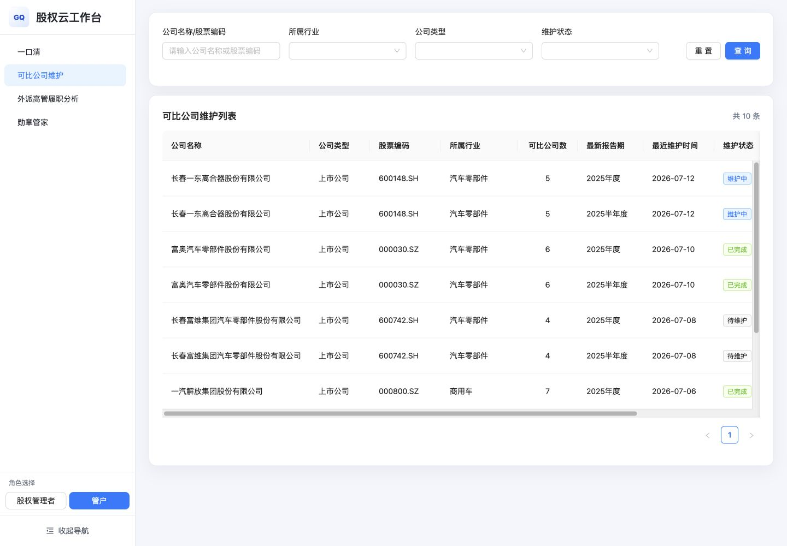

2.1.2.3 查询条件

列表页顶部提供：

| 查询项 | 控件 |
| --- | --- |
| 公司名称/股票编码 | 文本输入框 |
| 所属行业 | 下拉选择 |
| 公司类型 | 下拉选择 |
| 维护状态 | 下拉选择 |

操作按钮：

- 查询：按当前条件刷新列表。
- 重置：清空全部查询条件并恢复默认列表。

2.1.2.4 列表字段

| 字段 | 说明 |
| --- | --- |
| 公司名称 | 参股公司全称 |
| 公司类型 | 上市公司、非上市公司 |
| 股票编码 | 上市公司展示股票编码，非上市公司可展示“--” |
| 所属行业 | 公司所属行业 |
| 可比公司数 | 当前已维护的可比公司数量 |
| 最新报告期 | 当前维护数据对应报告期 |
| 最近维护时间 | 最近一次维护日期 |
| 维护状态 | 待维护、维护中、已完成 |
| 操作 | 可比公司、查看详情 |

2.1.2.5 列表操作

- “可比公司”：进入当前公司和报告期的维护执行页。
- “查看详情”：进入当前公司和报告期的查看页。
- 列表底部显示总条数和分页控件。

2.1.3 可比公司任务执行页面

页面地址：http://www.prompt.ski/companyMaintenance?fromTask=1&companyId=cc-001&year=2025&period=annual

工作台存放位置：股权云工作台 → 运营管理

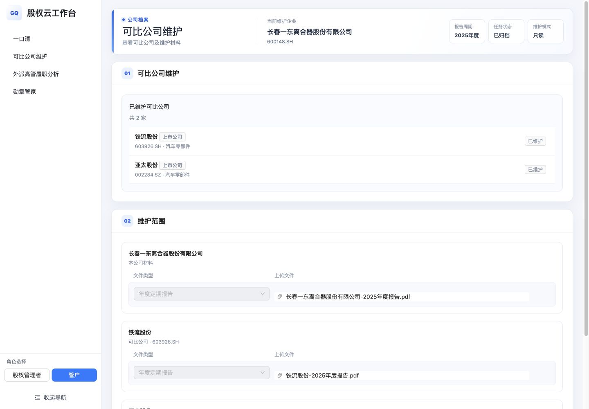

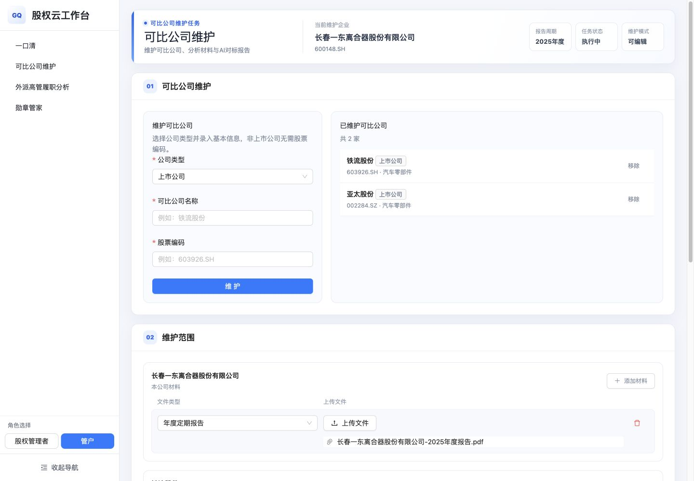

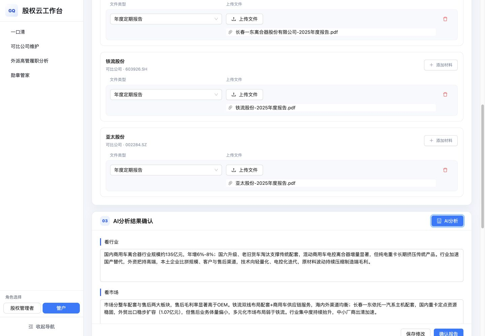

2.1.3.1 详情页顶部

详情页顶部展示：
- 页面标题：可比公司维护。
- 页面说明。
- 当前维护企业。
- 股票编码。
- 报告周期。
- 任务状态。
- 维护模式。

维护模式分为：

- 可编辑：从任务进入并且处于维护中的记录。

2.1.3.2 第一步：可比公司维护

可编辑模式下展示维护表单：

| 字段 | 内容 |
| --- | --- |
| 公司类型 | 上市公司、非上市公司 |
| 可比公司名称 | 可比公司名称 |
| 股票编码 | 上市公司股票编码 |

点击“维护”后，将公司加入“已维护可比公司”列表。

已维护可比公司卡片展示：

- 公司名称。
- 公司类型。
- 股票编码。
- 所属行业。
- 移除。

只读模式下不显示录入表单和移除按钮，只展示已维护结果。

2.1.3.3 第二步：维护范围

维护范围包含：

1. 当前参股公司材料。
2. 每一家可比公司的材料。

每个公司材料区展示：

- 公司名称。
- “本公司材料”或“可比公司”标识。
- 股票编码。
- 添加材料。
- 文件类型。
- 上传文件。
- 已上传文件名。
- 删除文件。
- 删除材料行。

可编辑模式下支持添加、上传和删除；只读模式下仅展示文件类型和文件。

2.1.3.4 第三步：AI 分析结果确认

点击“AI 分析”后：

1. 按钮进入加载状态。
2. 页面提示 AI 正在读取材料、提取财务指标并生成对标分析。
3. 分析完成后展示可编辑结果。

AI 分析结果包含：

- 看行业。
- 看市场。
- 看竞争。
- 看自己。
- 整体结论。

“看竞争”包含对比表格和分析结论。对比表格至少支持：

- 公司。
- 营收。
- 归母净利润。
- 归母净资产。
- 毛利率。
- 市值或规模排序。

结果操作：

- 重新分析：重新生成分析内容。
- 保存修改：保存用户对分析文本的编辑。
- 确认报告：确认当前报告结果。

确认完成后，当前记录状态更新为已完成或已归档，并可在一口清“对标情况”中展示确认后的内容。

### 2.2 外派高管履职分析

2.2.1 外派高管履职分析任务页面

页面路由：http://www.prompt.ski/djghome

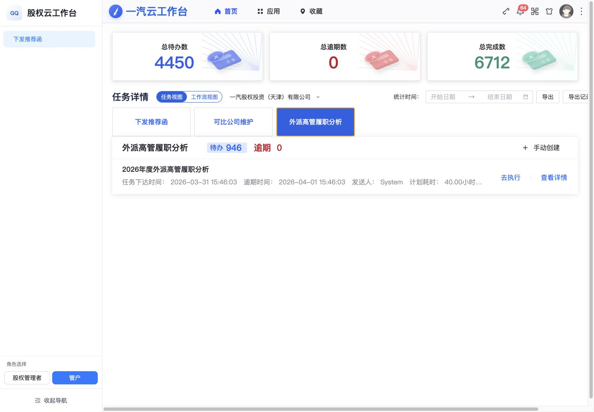

用户在任务工作台选择“外派高管履职分析”后，下方任务列表切换为外派高管履职分析任务。任务记录展示任务名称、任务下达时间、逾期时间、发送人、计划耗时、执行时间和任务描述。

- 点击“去执行”，进入对应公司的外派高管履职分析执行页。

2.2.2 外派高管履职分析列表页面

2.2.2.1 列表路由

http://www.prompt.ski/executiveMaintenanceList

2.2.2.2 页面截图

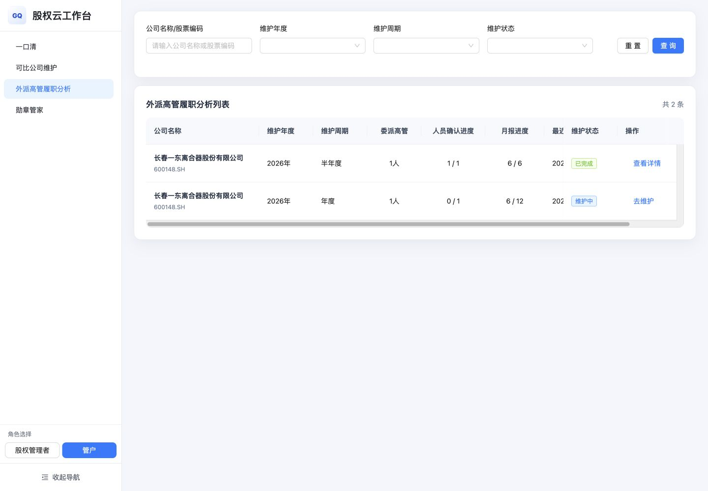

2.2.2.3 查询条件

| 查询项 | 控件 |
| --- | --- |
| 公司名称/股票编码 | 文本输入框 |
| 维护年度 | 下拉选择 |
| 维护周期 | 年度、半年度 |
| 维护状态 | 待维护、维护中、已完成 |

操作按钮：

- 查询。
- 重置。

2.2.2.4 列表字段

| 字段 | 说明 |
| --- | --- |
| 公司名称 | 任职单位全称，同时展示股票编码 |
| 维护年度 | 当前任务年度 |
| 维护周期 | 年度或半年度 |
| 委派高管 | 当前公司委派高管人数 |
| 人员确认进度 | 已确认人数 / 总人数 |
| 月报进度 | 已完成月报数 / 应完成月报数 |
| 最近维护时间 | 最近维护日期 |
| 维护状态 | 待维护、维护中、已完成 |
| 操作 | 去维护、查看详情 |

状态对应操作：

- 维护中：显示“去维护”。
- 已完成：显示“查看详情”。

2.2.3 外派高管履职分析任务执行页面

页面地址：http://www.prompt.ski/executiveMaintenance?company=%E9%95%BF%E6%98%A5%E4%B8%80%E4%B8%9C&year=2026&period=%E5%B9%B4%E5%BA%A6

工作台存放位置：股权云工作台 → 董监高管理

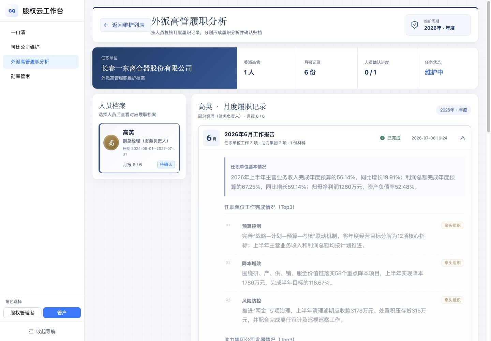

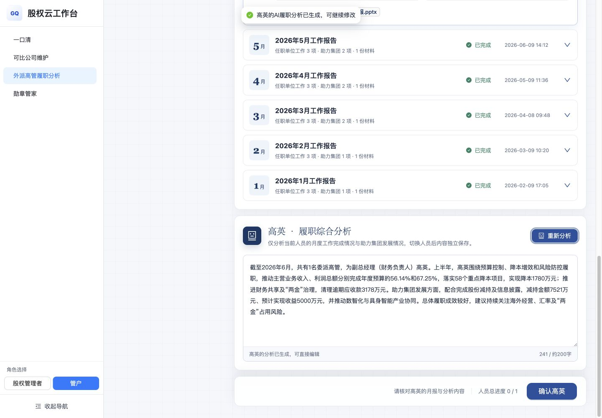

2.2.3.1 执行页顶部

取数来源：[外派高管月报复核](https://iwork.faw.cn/gq-0207_app_002/monthRecordReview)
顶部展示：

- 返回维护列表。
- 标题“外派高管履职分析”。
- 页面说明。
- 维护年度和周期。
- 任职单位。
- 委派高管人数。
- 月报记录数。
- 人员确认进度。
- 任务状态。

2.2.3.2 人员档案

人员档案区按委派高管展示人员卡片。人员卡片包含：

- 姓名。
- 职务。
- 任期。
- 月报完成进度。
- 确认状态。

点击人员卡片后，右侧切换到对应人员的月度履职记录和履职综合分析。不同人员的分析内容和确认状态独立保存。

2.2.3.3 月度履职记录

每月记录以可展开卡片展示：

- 月份。
- 报告名称。
- 任职单位工作事项数量。
- 助力集团事项数量。
- 补充材料数量。
- 完成状态。
- 更新时间。

展开后展示：

1. 任职单位基本情况。
2. 任职单位工作完成情况。
3. 助力集团公司发展情况。
4. 工作中存在的问题。
5. 下月工作计划。
6. 其他需报告事项。
7. 专项管理建议。
8. 补充材料。

任职单位工作和助力集团事项按序号、事项名称、内容和责任方式展示。

2.2.3.4 履职综合分析

履职综合分析区展示：

- 当前人员姓名。
- 分析说明。
- AI 智能分析或重新分析按钮。
- 分析文本编辑区。
- 当前字数。
- 人员确认提示。
- 人员总进度。
- 确认当前人员按钮。

点击“AI 智能分析”后：

1. 读取当前人员在当前维护周期内的月度履职记录。
2. 生成当前人员的综合履职分析。
3. 将结果写入文本编辑区。
4. 用户可以继续修改结果。
5. 已生成后按钮显示为“重新分析”。

2.2.3.5 人员确认

点击“确认{人员姓名}”时：

1. 若当前人员未形成分析内容，页面提示先生成或填写分析。
2. 已有分析内容时，弹出确认操作。
3. 确认后，该人员状态变为“已确认”。
4. 页面顶部人员确认进度同步更新。
5. 全部人员确认完成后，任务状态更新为“已完成”。
6. 确认后的分析内容进入一口清“委派高管履职”模块。

### 2.3 一口清

2.3.1 页面路由

/comapnyList

> 路由名称按当前项目保持为 comapnyList。

2.3.2 页面截图

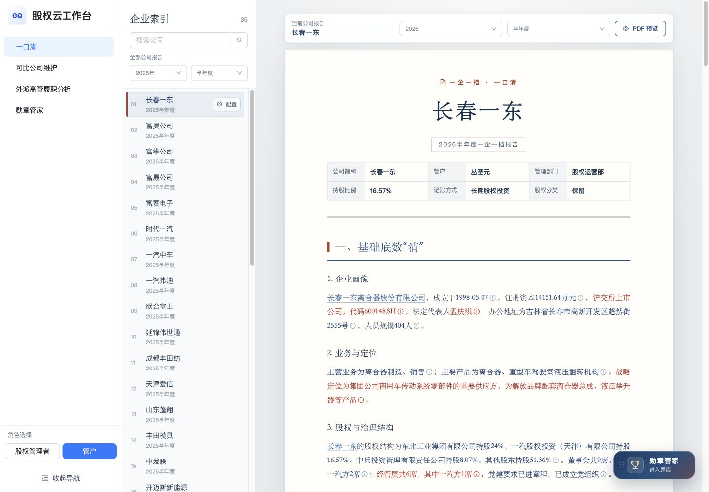

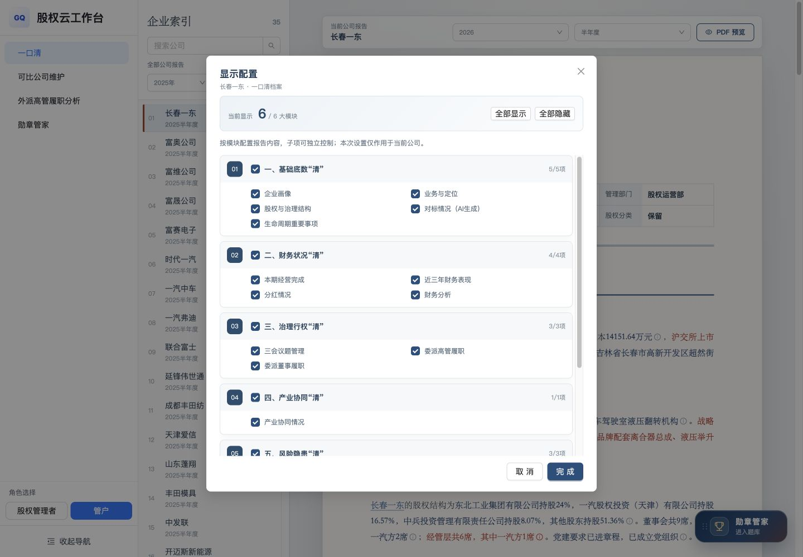

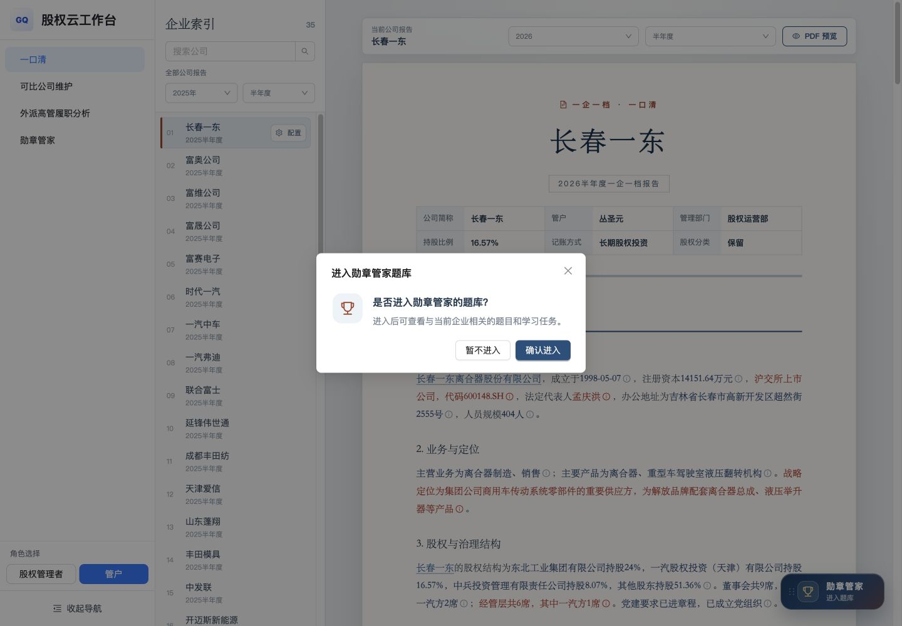

2.3.3 页面布局

页面采用三部分布局：

1. 系统左侧菜单。
2. 企业索引栏。
3. 一口清报告正文。

2.3.4 企业索引栏

企业索引栏包含：

- 标题“企业索引”。
- 企业总数。
- 公司搜索框。
- 搜索按钮。
- 报告范围选择。
- 年度选择。
- 报告周期选择。
- 公司列表。

公司列表项展示：

- 序号。
- 公司简称。
- 当前报告期。
- 当前选中公司的“配置”按钮。

交互要求：

1. 输入公司名称后执行搜索，企业列表只展示匹配项。
2. 切换年度或报告周期后，列表项报告期和右侧报告内容同步切换。
3. 点击公司列表项后，右侧切换到对应公司的报告。
4. 当前选中公司保持高亮。
5. 企业列表区域支持纵向滚动。

2.3.5 报告顶部

报告顶部包含：

- “当前公司报告”标识。
- 当前公司简称。
- 报告年度选择。
- 报告周期选择。
- “PDF 预览”按钮。
- 报告封面标题“一企一档 · 一口清”。
- 公司简称。
- 报告年度及周期。
- 管户。
- 管理部门。
- 持股比例。
- 记账方式。
- 股权分类。

2.3.6 报告正文结构

报告正文包含六个一级模块。

2.3.6.1 基础底数“清”

包含：

1. 企业画像。
2. 业务与定位。
3. 股权与治理结构。
4. 对标情况。
5. 生命周期重要事项。

“对标情况”包含：

- 看行业。
- 看市场。
- 看竞争。
- 看自己。
- 整体结论。

“看竞争”支持表格化展示本公司与可比公司的营收、归母净利润、归母净资产、毛利率和规模排序等指标。

2.3.6.2 财务状况“清”

包含：

1. 本期经营完成。
2. 近三年财务表现。
3. 分红情况。
4. 财务分析。

“财务分析”包含：

- 综合评价。
- 盈利能力。
- 偿债能力。
- 现金流量。
- 营运能力。
- 预警总结。

2.3.6.3 治理行权“清”

包含：

1. 三会议题管理。
2. 委派高管履职。
3. 委派董事履职。

委派高管履职展示外派高管履职分析确认后的汇总内容。

2.3.6.4 产业协同“清”

包含：

- 战略定位。
- 战略执行。
- 战略成果。

2.3.6.5 风险隐患“清”

包含：

1. 审计发现问题及整改明细。
2. 风险情况。
3. 国资委监管要求整改。

审计问题及风险信息以卡片形式展示状态、责任单位、责任人、问题摘要和时间信息。

2.3.6.6 管理策略“清”

包含：

- 产业协同。
- 经营管理。
- 股权经营。

2.3.7 数据来源标记

报告中的关键数据和段落支持显示数据来源标记。用户通过标记可查看该内容对应的业务系统或数据来源说明。

2.3.8 显示配置

点击选中公司旁的“配置”按钮，打开“显示配置”弹窗。

弹窗顶部展示：

- 当前公司及档案名称。
- 当前已显示模块数 / 模块总数。
- 全部显示。
- 全部隐藏。

配置内容按六个一级模块分组，每组包含：

- 模块序号。
- 一级模块复选框。
- 已显示子项数 / 子项总数。
- 子项复选框。

交互规则：

1. 用户可以控制一级模块是否显示。
2. 用户可以独立控制模块下的子项是否显示。
3. 点击“全部显示”后选中所有模块及子项。
4. 点击“全部隐藏”后取消所有模块及子项。
5. 点击“完成”保存本次配置并更新报告正文。
6. 点击“取消”或关闭弹窗不应用本次修改。
7. 配置只作用于当前公司。

2.3.9 PDF 预览

点击“PDF 预览”后，以 PDF 版式预览当前公司、当前年度、当前周期及当前显示配置对应的一口清报告。

2.3.10 勋章管家入口

报告页面右下方显示“勋章管家 / 进入题库”悬浮入口。

点击后打开确认弹窗：

- 标题：进入勋章管家题库。
- 提示：是否进入勋章管家的题库？
- 说明：进入后可查看与当前企业相关的题目和学习任务。
- 暂不进入。
- 确认进入。

点击“确认进入”跳转至 /projectExam；点击“暂不进入”关闭弹窗并留在当前报告。

## 三、核心业务流程

### 3.1 可比公司维护到一口清

1. 用户在 /djghome 切换到“可比公司维护”。
2. 点击任务“去执行”。
3. 进入可比公司维护执行页。
4. 维护可比公司。
5. 为本公司及各可比公司维护材料。
6. 点击“AI 分析”。
7. 查看并修改“看行业、看市场、看竞争、看自己、整体结论”。
8. 保存修改。
9. 确认报告。
10. 在一口清“基础底数清—对标情况”中展示确认结果。

### 3.2 外派高管履职分析到一口清

1. 用户在 /djghome 切换到“外派高管履职分析”。
2. 点击任务“去执行”。
3. 进入外派高管履职分析页。
4. 选择委派高管。
5. 查看该人员各月履职记录和补充材料。
6. 点击“AI 智能分析”。
7. 修改履职综合分析。
8. 确认当前人员。
9. 依次完成全部人员确认。
10. 在一口清“治理行权清—委派高管履职”中展示确认结果。

## 四、页面状态与状态变化

### 4.1 可比公司维护状态

| 状态 | 列表操作 | 详情模式 |
| --- | --- | --- |
| 待维护 | 可比公司/去维护 | 可编辑 |
| 维护中 | 可比公司/去维护 | 可编辑 |
| 已完成 | 查看详情 | 只读 |
| 已归档 | 查看详情 | 只读 |

### 4.2 外派高管履职分析状态

| 状态 | 列表操作 | 页面表现 |
| --- | --- | --- |
| 待维护 | 去维护 | 尚未完成分析 |
| 维护中 | 去维护 | 部分人员未确认 |
| 已完成 | 查看详情 | 全部人员已确认 |

### 4.3 人员确认状态

| 状态 | 页面表现 |
| --- | --- |
| 待确认 | 人员卡片显示“待确认”，确认按钮可用 |
| 已确认 | 人员卡片显示“已确认”，顶部进度增加 |

## 五、页面跳转规则

| 来源页面 | 操作 | 目标页面 |
| --- | --- | --- |
| /djghome | 可比公司维护任务—去执行 | /companyMaintenance |
| /djghome | 外派高管履职分析任务—去执行 | /executiveMaintenance |
| /companyMaintenanceList | 可比公司 | /companyMaintenance 可编辑模式 |
| /companyMaintenanceList | 查看详情 | /companyMaintenance 查看模式 |
| /executiveMaintenanceList | 去维护 | /executiveMaintenance |
| /executiveMaintenanceList | 查看详情 | /executiveMaintenance |
| 公共侧边栏 | 点击菜单 | 对应菜单路由 |

跳转时应携带当前业务记录对应的公司、年度、周期及任务标识，使目标页直接定位到正确数据。

## 六、交互与视觉要求

1. 保持当前页面以一汽蓝为主色的视觉风格。
2. 当前导航、当前任务卡片、当前人员和当前功能页签必须具有明确选中状态。
3. 列表页查询条件和表格对齐，操作列固定在右侧。
4. 状态使用标签或状态色进行区分。
5. AI 分析过程中显示明确加载状态，避免用户重复点击。
6. 长页面使用内部滚动或页面滚动，顶部关键操作保持清晰可见。
7. 弹窗和抽屉打开时，背景内容不可误操作。
8. 可编辑模式与只读模式在按钮和输入控件上有明显区别。
9. 一口清报告正文保持报告型阅读体验，一级模块、二级模块和正文层级清晰。
10. 页面中的日期、金额、比例、数量和状态采用统一展示格式。

## 七、变更范围汇总

| 模块 | 新增/调整内容 | 使用端 |
| --- | --- | --- |
| 可比公司维护 | 工作台任务、维护列表、公司维护、材料维护、AI 对标分析、确认 | PC |
| 外派高管履职分析 | 工作台任务、分析列表、月报复核、AI 履职分析、人员确认 | PC |
| 一口清 | 企业索引、六大报告模块、显示配置、PDF 预览、勋章入口 | PC |
